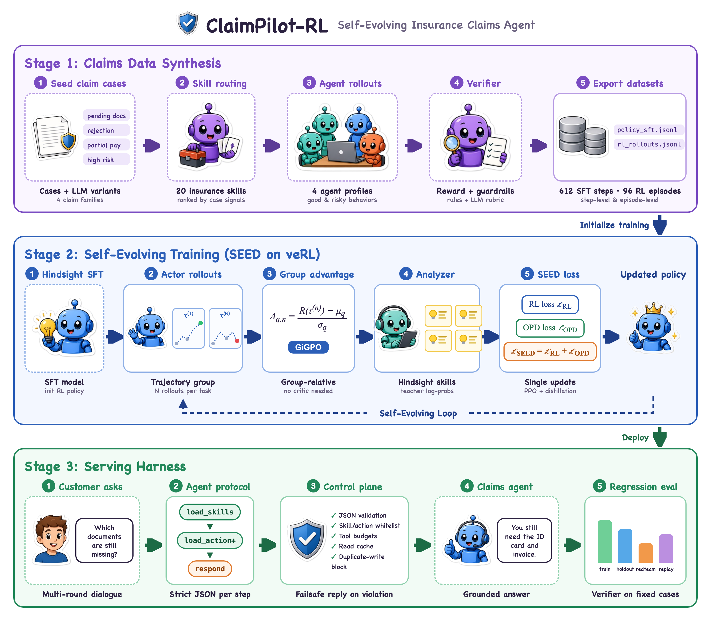

# ClaimPilot-RL

**An LLM agent for insurance-claims customer service, built around skill-routed tool use, a verifiable sandbox, and self-evolving reinforcement learning.**

保险理赔客服智能体：技能路由 + 工具调用 + 可验证沙箱 + 自进化强化学习（SFT → GiGPO / SEED）。


---

## Highlights

- **Skill-routed agent protocol.** Every turn follows `user question → load_skills → load_action* → respond`. One skill per round, and actions are whitelisted per skill, so the agent cannot call tools outside the loaded skill's scope.
- **Claims sandbox with simulated business tools.** 20 insurance skills (pending documents, rejection reconsideration, partial payment breakdown, fraud-risk escalation, and more), plus read/write tools that mutate a simulated world state.
- **Rule + LLM hybrid verifier.** An episode-level reward combines the outcome, policy coverage, evidence grounding, efficiency, and communication, minus hard-guardrail and soft penalties (for example, unauthorized payout promises or a missed mandatory escalation).
- **Synthetic data pipeline.** Seed cases are augmented by an LLM, rolled out by four agent profiles of different quality, verified, and exported as step-level SFT data and episode-level RL rollouts.
- **Serving harness with a runtime control plane.** Step-by-step JSON validation, tool budgets, a read cache, duplicate side-effect blocking, a failsafe reply, and fixed-case regression with red-team buckets.
- **Self-evolving RL training.** Uses [SEED](SEED/) on top of veRL: hindsight-skill SFT, then on-policy distillation combined with PPO/GiGPO.

## Architecture



## Repository layout

```text
ClaimPilot-RL/
├── claim_agent_sandbox/         # Insurance-claims environment and data pipeline
│   ├── build_datasets.py        # Entry point: cases → rollouts → SFT/RL datasets
│   ├── claim_sandbox/
│   │   ├── cases/               # Seed claim cases (4 families)
│   │   ├── insurance_skills/    # 20 skill cards (goal, allowed actions, guardrails)
│   │   ├── skill_router.py      # Ranks skills from case signals and user wording
│   │   ├── tools.py             # Simulated read/write business tools
│   │   ├── verifier.py          # Episode reward, guardrails, LLM rubric
│   │   ├── prompt_format.py     # Trajectory → step-level training samples
│   │   ├── exporters.py         # SFT / RL record builders
│   │   └── harness/             # Serving harness, control plane, regression
│   └── artifacts/               # Generated datasets and regression reports
├── SEED/                        # Self-evolving RL framework (veRL + GiGPO + OPD)
└── docs/                        # Design notes, technical notes, run guide
```

## The agent protocol

At every step the model receives a structured context (system prompt, available skills, case signals, accumulated dialogue history, loaded skill content, and recent tool observations). It must return exactly one of three strict JSON objects:

```json
{"type": "load_skills", "skill_name": "pending_docs_resolution", "message": "..."}
{"type": "load_action", "skill_name": "pending_docs_resolution", "action_name": "get_required_documents", "action_input": {}, "message": "..."}
{"type": "respond",     "skill_name": "pending_docs_resolution", "message": "Your claim is pending the ID card, medical record, and invoice."}
```

Training and serving share this input/output format, so a model trained on the synthetic data can run in the harness without any adaptation layer.

## Reward design

```text
R = 1.00·outcome + 0.25·policy + 0.15·evidence + 0.10·efficiency + 0.10·communication − penalties
```

| Component | Source | What it measures |
| --- | --- | --- |
| outcome | Rules | Predicted vs. ideal disposition (−1.0 if a hard guardrail fires) |
| policy | LLM rubric | Coverage of the case's required actions |
| evidence | LLM rubric | Whether the reply is grounded in tool results |
| efficiency | Rules | Number of dialogue turns |
| communication | LLM rubric | Clarity, directness, and safety of the reply |
| penalties | Rules | Unauthorized promises, invalid writes, missed escalation, tool loops, and so on |

Full details: [`claim_agent_sandbox/README.md`](claim_agent_sandbox/README.md).

## Generated data

| Artifact | Size | Notes |
| --- | --- | --- |
| `policy_sft.jsonl` | 612 step samples | Step-level `load_skills` / `load_action` / `respond` targets |
| `rl_rollouts.jsonl` | 96 episodes | 24 cases × 4 agent profiles, with terminal reward |

The four rollout profiles (`rule_based`, `llm_skill`, `risky_shortcut`, `over_escalating`) deliberately produce trajectories of mixed quality. In the shipped dataset, `risky_shortcut` averages a reward of −0.25 with 0/24 successes, while the other three profiles average 0.885. This gives RL a clear contrast between good and bad behavior.

## Quick start

```bash
# 0. Configure an OpenAI-compatible endpoint (used for case variants and the LLM rubric)
export AIGC_BASE_URL=<your-endpoint>
export AIGC_APP_ID=<your-api-key>
export FILL_THOUGHT_MODEL=<model-name>

# 1. Build the SFT and RL datasets
cd claim_agent_sandbox
python3 build_datasets.py --outdir artifacts/final_dataset

# 2. Run a single case through the serving harness
python3 -m claim_sandbox.harness.serving --case-id claim_rejection_dispute_0202 --max-steps 8
```

For RL training with SEED (environment setup, model download, SFT, and RL launch scripts), see [`docs/Running.md`](docs/Running.md).

## Documentation

- [`claim_agent_sandbox/README.md`](claim_agent_sandbox/README.md): data pipeline, reward, and serving harness
- [`docs/SEED.md`](docs/SEED.md): key code walkthrough of the SEED training stages
- [`docs/SEED_Technical_Notes.md`](docs/SEED_Technical_Notes.md): algorithm notes
- [`docs/Running.md`](docs/Running.md): end-to-end training guide

## Acknowledgements

The `SEED/` directory is adapted from [jinyangwu/SEED](https://github.com/jinyangwu/SEED) (MIT License, © AIMING Lab), which builds on [veRL](https://github.com/volcengine/verl). See [`SEED/LICENSE`](SEED/LICENSE) and [`SEED/Notice.txt`](SEED/Notice.txt).
