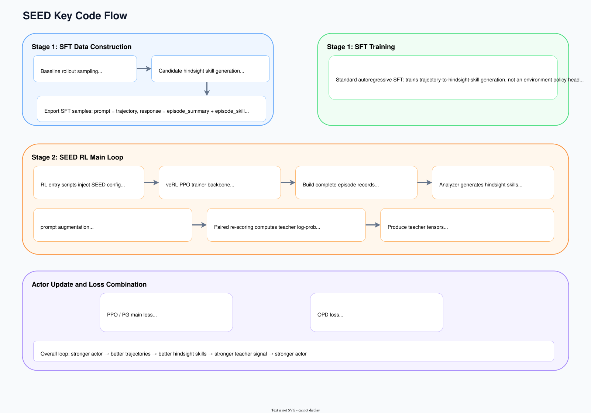

# Key Code

## Project Flow Overview

Following the paper, the implementation can be organized into two stages:

- Stage 1: Hindsight-Skill SFT
- Stage 2: Self-Evolving OPD

The implementation relies directly on several established frameworks and techniques:

|Framework or technique|Where it appears in the project|Role|
|---|---|---|
|veRL|verl/, scripts/sft/_common/trainer.sh, examples/seed_trainer|Main training framework; handles SFT, rollout, log-prob recomputation, and PPO/OPD updates|
|PyTorch|Underlying the whole project|Model training, tensor computation, loss backpropagation|
|FSDP|verl.trainer.fsdp_sft_trainer, RL actor/ref configuration|Distributed parameter sharding for large-model training in both the SFT and RL stages|
|torchrun|scripts/sft/_common/trainer.sh|Launches multi-process distributed SFT|
|vLLM|policy_vllm backend, rollout worker|Generation backend for rollout and policy-as-analyzer during the RL stage|

The main execution path is:

|Stage|Role|Key files|
|---|---|---|
|Stage 1: SFT data construction|Sample baseline trajectories, call the analyzer to generate hindsight skills, export parquet|scripts/sft/_common/pipeline.py, scripts/sft/search/pipeline.py, scripts/sft/alfworld/pipeline.py|
|Stage 1: SFT training|Train the hindsight-skill generator on the exported prompt/response samples|scripts/sft/_common/trainer.sh|
|Stage 2: Trajectory analysis|Turn a complete trajectory into an episode skill and step skills|seed/analysis.py|
|Stage 2: Teacher signal construction|Turn hindsight skills into teacher log-probs and masks; the related settings are injected into the trainer by examples/seed_trainer/_common/alfworld.sh and examples/seed_trainer/_common/search.sh|verl/trainer/ppo/ray_trainer.py|
|Stage 2: Actor update|Combine the PPO and OPD losses|verl/workers/actor/dp_actor.py|

The code path is shown below:

## 1. Project Structure and Entry Points

The project's underlying skeleton comes from veRL; the SEED method is added incrementally on top of the existing training framework.

The relevant directories are:

|Directory or file|Role|
|---|---|
|scripts/sft|Stage 1 data construction and SFT training entry points|
|seed|SEED-specific logic for hindsight analysis, prompt augmentation, and skill reward|
|examples/seed_trainer|RL launch scripts for each task|
|verl|Core framework for rollout, teacher scoring, and loss backpropagation|

This document proceeds in the following order:

1. Stage 1: SFT data construction — how complete trajectories become hindsight-skill supervision samples
2. Stage 1: SFT training — how these samples train the model into an analyzer-capable policy
3. Stage 2: seed/analysis.py — how the current policy doubles as the analyzer and turns a trajectory into hindsight skills
4. Stage 2: ray_trainer.py — how the trainer, combined with the settings injected by the training scripts, turns hindsight skills into a teacher signal
5. Stage 2: dp_actor.py — how the actor merges PPO and OPD into a single update

## 2. Stage 1: Hindsight-Skill SFT

Stage 1 of the paper corresponds to two pieces of code:

- SFT data construction: scripts/sft/_common/pipeline.py and the task-specific pipelines
- SFT training: scripts/sft/_common/trainer.sh

The goal of this stage is to train the model into an analyzer-capable policy that can read a complete trajectory and output an episode_summary and an episode_skill.

### 1. SFT Data Construction

Stage 1 data construction lives in the pipeline.

The shared flow is in scripts/sft/_common/pipeline.py, and the task-specific versions are:

- scripts/sft/alfworld/pipeline.py
- scripts/sft/search/pipeline.py

The relevant functions are described below.

#### 1.1 run_rollout_specs

The shared implementation is at scripts/sft/_common/pipeline.py:652.

Responsibilities:

- Create an environment manager from the task spec
- Drive the agent rollout through the policy endpoint
- Record observation, prompt, model response, executed action, reward, done, and other fields at each step
- Store each complete episode in trajectories

If the current rollout spec includes an episode_skill, the function calls build_augmented_observation_text in seed/prompting.py to inject the skill into the observation prompt. SFT data construction therefore supports two input formats: plain context and skill-augmented context.

#### 1.2 build_candidate_skill_record

See scripts/sft/_common/pipeline.py:941.

The function:

- Converts the rollout trajectory into the steps format the analyzer expects
- Builds the episode analysis prompt
- Calls SEEDEpisodeAnalyzer
- Parses the JSON output
- Stores the episode_summary, episode_skill, raw output, parse status, and any error message

The records produced here target trajectory summarization; the downstream training goal is to generate reusable rules from completed trajectories.

#### 1.3 generate_candidate_skills

See scripts/sft/_common/pipeline.py:1067.

This function submits all previously collected baseline rollouts to a thread pool and calls build_candidate_skill_record on each one. The output is candidate_skills.jsonl.

This layer keeps the intermediate candidate-skill records. The project saves the analyzer output first and only then feeds it to the trainer, which makes it easy to:

- check the parse success rate
- inspect the quality of the skill text
- trace a skill back to its source trajectory
- run validation or re-export later

#### 1.4 build_sft_exports

See scripts/sft/_common/pipeline.py:1286.

This function keeps the accepted samples and exports:

- sft_episode_skill_all.jsonl
- sft_episode_skill_train.parquet
- sft_episode_skill_val.parquet

The output of Stage 1 is the set of supervision samples needed to train hindsight-skill generation.

### 2. SFT Training Entry Point

The shared SFT training entry point is scripts/sft/_common/trainer.sh. This script hands the exported hindsight-skill samples to veRL's FSDP SFT trainer.

The script assumes the following SFT sample format:

- prompt: the analysis input obtained by serializing the complete trajectory
- response: the target JSON, usually containing episode_summary and episode_skill

The script does four things:

1. Reads the training and validation data
2. Assembles the veRL FSDP SFT arguments
3. Launches multi-process training with torchrun
4. After training, exports the latest checkpoint as a model directory that the RL stage can load directly

Start with the key data-side parameters.

|Parameter|Role|
|---|---|
|data.train_files|Training-set parquet path; defaults to sft_episode_skill_train.parquet|
|data.val_files|Validation-set parquet path; defaults to sft_episode_skill_val.parquet|
|data.prompt_key=prompt|Which column of the sample is used as model input|
|data.response_key=response|Which column of the sample is used as the supervision target|
|data.max_length|Maximum total length of a single sample|
|data.truncation|How over-length samples are handled; defaults to error|
|data.train_batch_size|Training batch size|
|data.micro_batch_size_per_gpu|Per-GPU micro-batch size, used for gradient accumulation|

Next, the model-side parameters. The goal of SFT is to give the model the ability to "read a complete trajectory and output a hindsight skill".

|Parameter|Role|
|---|---|
|model.partial_pretrain|Path to the starting model for SFT|
|model.enable_gradient_checkpointing=True|Enables gradient checkpointing to reduce GPU memory usage|
|ulysses_sequence_parallel_size|Sequence-parallel setting for long-sequence training|

Then the optimization and scheduling parameters.

|Parameter|Role|
|---|---|
|optim.lr|SFT learning rate, passed in via the LR variable in the script|
|trainer.total_epochs|Total number of epochs; defaults to TOTAL_EPOCHS=3|
|NPROC_PER_NODE|Number of distributed training processes; defaults to 8|
|TRAIN_BATCH_SIZE|Global training batch size; defaults to 8|
|MICRO_BATCH_SIZE_PER_GPU|Per-GPU micro-batch size; defaults to 1|
|TRAINER_LOGGER|Logging backend; defaults to console + wandb|

Finally, the training command:

- Launch multi-process training with torchrun --nproc_per_node=$NPROC_PER_NODE
- Each process runs veRL's fsdp_sft_trainer

Stage 1 performs standard autoregressive SFT: the input is a complete trajectory and the output is a structured hindsight analysis. The result is an SFT checkpoint, which then initializes the RL actor and serves as the starting point for trajectory-analysis ability.

## 3. Stage 2: Self-Evolving OPD

Stage 2 of the paper corresponds to three pieces of code:

- Trajectory analysis: seed/analysis.py
- Teacher signal construction: verl/trainer/ppo/ray_trainer.py
- Actor update: verl/workers/actor/dp_actor.py

Together they implement the paper's main loop, in which the current policy acts as both actor and analyzer and the behavioral effect of hindsight skills is then distilled back into the ordinary policy.

### 1. seed/analysis.py: The Trajectory Analyzer

The core of the SEED method is SEEDEpisodeAnalyzer in seed/analysis.py.

The class has a clear responsibility: take a complete episode as input and output a structured hindsight analysis.

#### 1.1 SEEDEpisodeAnalyzer

It supports two backends:

- openai: calls an external OpenAI-compatible API for analysis
- policy_vllm: reuses the current on-policy model for analysis during the RL stage

This is where the paper's idea of the current policy acting as both actor and analyzer lands in the code. SFT data construction usually uses openai, while the RL stage can switch to policy_vllm.

#### 1.2 analyze_episode

The entry point is at seed/analysis.py:309.

It dispatches to the prompt-construction and result-parsing logic.

#### 1.3 _build_default_episode_analysis_prompt

See seed/analysis.py:618.

Episodes are handled in three modes:

- episode_only
- step_only
- episode_step

The analysis target also switches depending on whether the episode succeeded:

- Successful trajectory: extract the successful workflow
- Failed trajectory: extract avoidance rules

Here SEED requires the analyzer to output a policy-facing skill. The prompt emphasizes:

- do not write a retrospective narrative
- write action rules addressed to the policy
- a step skill applies only to the current decision point

The analyzer output is used directly for subsequent prompt augmentation and teacher scoring.

#### 1.4 _parse_analysis_response

See seed/analysis.py:858.

It parses the model output into a unified format:

|Field|Meaning|
|---|---|
|episode_summary|A short summary of the whole trajectory|
|episode_skill|A general skill that applies to the whole episode|
|step_skills|Local decision skills indexed by step index|

The trainer consumes this structure directly when it builds the teacher signal.

### 2. ray_trainer.py: Teacher Signal Construction

The SEED teacher signal is implemented in _prepare_seed_teacher_signals at verl/trainer/ppo/ray_trainer.py:2348.

Before this function runs, the training entry scripts inject the SEED settings into veRL's PPO configuration. The relevant scripts are examples/seed_trainer/_common/alfworld.sh and examples/seed_trainer/_common/search.sh.

First, the settings in those scripts.

- algorithm.adv_estimator=seed
  Routes the trainer into the SEED branch instead of the ordinary advantage branch.

- actor_rollout_ref.actor.opd_loss_coef
  The direct weight of the OPD loss. When it is 0, the actor update does not add the OPD term to the policy loss, even if teacher_log_prob has already been computed.

- actor_rollout_ref.actor.opd_gate_beta
  The steepness of the OPD gate. The gap between the teacher log-prob and the ordinary log-prob first passes through a sigmoid gate; a larger beta makes the gate closer to a hard threshold, and a smaller beta makes it smoother.

- algorithm.seed.opd_start_after_steps
  The step at which OPD starts. Before the global step reaches this threshold, the trainer may still run trajectory analysis, but it does not use the teacher signal to drive OPD.

- algorithm.seed.opd_stop_after_steps
  The step at which OPD stops. After this step, the teacher signal no longer participates in the OPD update.

- algorithm.seed.enable_analysis
  The master switch. When it is off, _prepare_seed_teacher_signals skips analysis entirely, and tensors such as teacher_log_prob and critical_step_mask are filled with 0.

- algorithm.seed.selector
  The current implementation requires the llm branch here, meaning the trajectory's hindsight skill is generated by an LLM analyzer.

- algorithm.seed.analysis_backend
  Decides who acts as the analyzer. openai calls an external OpenAI-compatible backend; policy_vllm reuses the current on-policy model directly and generates the analysis on the rollout worker.

- algorithm.seed.analysis_num_workers
  The concurrency of the analysis stage. For the openai backend, it is the number of analysis requests the thread pool sends at once; for the policy_vllm branch, it mainly affects how batches are scheduled.

- algorithm.seed.analysis_max_completion_tokens
  Caps the length of a single analyzer output. Too small, and the episode skill or step skills may be truncated; too large, and analysis latency and cost go up.

- algorithm.seed.analysis_max_step_skills_per_traj
  Caps how many step skills are kept per trajectory. A larger value lets the teacher signal cover more local decision points; a smaller value biases the analysis toward keeping only the most critical steps.

- algorithm.seed.skill_mode
  Determines which skill sources the teacher signal may use:
  - episode_only: keep only the episode-skill branch
  - step_only: keep only the step-skill branch
  - episode_step: allow both kinds of skill into subsequent teacher scoring

- algorithm.seed.skill_teacher_mode
  Only makes a real difference when skill_mode=episode_step:
  - step_priority: if the current step has a step skill, use it; otherwise fall back to the episode skill
  - additive: the episode skill and step skill can both be computed, and both teacher branches enter the subsequent comparison

With these settings in place, _prepare_seed_teacher_signals runs through the following steps.

1. Reassemble the individual steps in the rollout batch into complete trajectories by traj_uid. Fields such as step_idx, obs_text, responses, and episode_success are restored here, because the analyzer works on whole episodes rather than single steps. Code: verl/trainer/ppo/ray_trainer.py:2443-2502.

2. Decide which trajectories to send for analysis based on the current settings. enable_analysis controls whether analysis is enabled at all, and the failed_only settings control whether only failed trajectories are analyzed. The paper extracts reusable workflows from successful trajectories and failure-avoidance rules from failed ones. Code: verl/trainer/ppo/ray_trainer.py:2503-2554.

3. Call analyze_episode in seed/analysis.py to produce episode_skill, step_skills, episode_summary, and the corresponding parse status for each trajectory. At this point the trainer still holds natural-language hindsight analysis, not teacher log-probs. Code: verl/trainer/ppo/ray_trainer.py:2555-2579.

4. Build critical_step_mask and the teacher-branch inputs from the analysis results. This step first applies trajectory-level gating: as long as a trajectory successfully produced a usable hindsight skill, all of its rollout steps are included in subsequent teacher scoring. In terms of the paper, this first determines which on-policy trajectories received a usable hindsight skill; the paired re-scoring under ordinary and skill-augmented contexts is then carried out only on the steps of those trajectories. Code: verl/trainer/ppo/ray_trainer.py:2580-2732.

5. Call build_augmented_observation_text to insert the hindsight skill back into the prompt. The episode skill is inserted near the task description as a global behavioral constraint; the step skill is inserted near the current action area and only affects the current decision. Next, select_skill_teacher_sources uses skill_mode and skill_teacher_mode to decide whether the current step computes the episode teacher, the step teacher, or both. Code: verl/trainer/ppo/ray_trainer.py:2733-2836.

6. Perform paired re-scoring in _compute_skill_log_probs. No actions are resampled here. Instead, the response tokens already generated in the original rollout are appended to the new prompt, and only their log-probs under the skill-augmented context are recomputed. The teacher branch differs from the ordinary branch only in the prompt context, not in the action sequence itself. Code: verl/trainer/ppo/ray_trainer.py:2838-3030.

This implementation is exactly paired re-scoring: the sampled actions stay the same, the response tokens stay the same, and the only change is whether the hindsight skill is injected into the context. The teacher branch and the ordinary policy branch therefore compare the probabilities of the same action sequence under different contexts.

Finally, the function writes the following tensors back to the batch:

|Tensor / notation in the paper|Meaning|
|---|---|
|teacher_log_prob / ℓ^skill_{q,n,t,ℓ}|The teacher log-prob ultimately used by OPD; corresponds to the paper's teacher-branch log-prob, recomputed for the same sampled action token under the skill-augmented context|
|episode_teacher_log_prob|An implementation-level split in the code: the teacher log-prob computed by the episode-skill branch alone.|
|step_teacher_log_prob|An implementation-level split in the code: the teacher log-prob computed by the step-skill branch alone.|
|critical_step_mask|The result of trajectory-level gating in the code, indicating which rollout steps enter subsequent teacher scoring. The paper does not define this tensor separately.|
|step_skill_mask|An implementation mask in the code, indicating which steps ultimately used the step-skill teacher branch. The paper does not define this tensor separately.|
|teacher_signal_mask|An implementation mask in the code, indicating which steps have teacher supervision. The paper has no tensor with this name; the token-level valid positions that actually enter Eq. (1) are obtained by further combining it with the valid-token mask m_{q,n,t,ℓ}.|

The snapshot and asynchronous merge logic for these tensors is at verl/trainer/ppo/ray_trainer.py:921 and verl/trainer/ppo/ray_trainer.py:952. _build_seed_teacher_signal_snapshot at ray_trainer.py:921 copies the fields needed for the teacher signal, and _prepare_seed_teacher_signals_async_task at ray_trainer.py:952 merges the asynchronous analysis results.

### 3. verl/workers/actor/dp_actor.py: Actor Update

The teacher signal is computed by the trainer, and backpropagation runs in DataParallelPPOActor in verl/workers/actor/dp_actor.py.

#### 3.1 Main PPO Loss

The core entry point of the actor update is verl/workers/actor/dp_actor.py:853-972.

This section first runs a forward pass on the current micro-batch to obtain the current policy's log-probs on the response tokens, then computes the PPO, OPD, KL, and optional environment auxiliary losses in turn. The most fundamental path is still PPO.

This document treats the main PPO loss at two levels: compute_policy_loss in verl/trainer/ppo/core_algos.py:431-492 is the computation, and verl/workers/actor/dp_actor.py:897-910 is where the actor calls it. The correspondence below refers to the compute_policy_loss level:

- Current-policy token log-prob: ℓ^θ_{q,n,t,ℓ}, corresponding to `log_prob` in the code
- Old-policy token log-prob: ℓ^old_{q,n,t,ℓ}, corresponding to `old_log_prob` in the code
- Token-level importance ratio: ρ_{q,n,t,ℓ}(θ)=exp(ℓ^θ_{q,n,t,ℓ}-ℓ^old_{q,n,t,ℓ}), corresponding to `ratio = torch.exp(log_prob - old_log_prob)` in the code
- Token-level advantage: A^rl_{q,n,t,ℓ}, corresponding to `advantages` in the code
- Valid-token mask: m_{q,n,t,ℓ}, corresponding to `response_mask` in this part of the code
compute_policy_loss computes in this order:

1. Compute negative_approx_kl = log_prob - old_log_prob, then exponentiate to get ratio.
2. Build the unclipped term -advantages * ratio from advantages and ratio.
3. Build the clipped term using the PPO clip range.
4. For regions with negative advantage, apply an additional dual-clip lower bound.
5. Finally, aggregate over valid tokens only using response_mask to get the scalar pg_loss.

The paper's L_rl(θ) does not have a function with exactly the same name in the implementation. It becomes the pg_loss returned by compute_policy_loss(...), on top of which entropy, OPD, KL, and other extra terms are added.

#### 3.2 OPD Loss

The code is split across two levels:

- verl/workers/actor/dp_actor.py:922-948 wires OPD into the actor update
- verl/trainer/ppo/core_algos.py:505-602 computes OPD itself

When all of the following hold:

- use_opd_loss is true
- teacher_log_prob is present in the batch
- a teacher mask is present in the batch

the code calls compute_opd_loss and:

- returns opd_loss
- returns gate-related statistics
- adds opd_loss_coef multiplied by opd_loss to policy_loss

The OPD implementation itself is compute_opd_loss at verl/trainer/ppo/core_algos.py:505. Its interface takes five inputs:

- log_prob
- teacher_log_prob
- response_mask
- opd_step_mask
- gate_beta

This part maps directly onto Section 3.3 of the paper, as shown in the table below:

|Quantity in the paper|Implementation in the code|Location|Notes|
|---|---|---|---|
|ordinary branch: ℓ^θ_{q,n,t,ℓ}|`log_prob`|dp_actor.py:940|Log-prob of the sampled token under the ordinary context for the current actor|
|teacher branch: ℓ^skill_{q,n,t,ℓ}|`teacher_log_prob`|Written back to the batch by ray_trainer.py, read on the actor side at dp_actor.py:941|Teacher log-prob obtained by re-scoring under the skill-augmented context|
|detached gap: Δ_{q,n,t,ℓ} = sg[ℓ^skill_{q,n,t,ℓ} - ℓ^θ_{q,n,t,ℓ}]|`teacher_gap = (teacher_log_prob - log_prob.detach()).detach()`|core_algos.py:575-576|Detached log-prob difference between teacher and ordinary branches|
|confidence gate: g_{q,n,t,ℓ} = σ(β_opd Δ_{q,n,t,ℓ})|`opd_gate = sigmoid(gate_beta * teacher_gap).detach()`|core_algos.py:577-580|Maps the teacher gap to a weight in [0,1]|
|valid-token mask: m_{q,n,t,ℓ}|`opd_mask = response_mask * opd_step_mask`|core_algos.py:540-556|The code adds an extra `opd_step_mask` layer not in the paper: it filters at the step level first, then keeps valid response tokens|
|OPD loss: L_opd(θ) = E[m · g · (sg[ℓ^skill] - ℓ^θ)]|`opd_loss_mat = opd_gate * (teacher_log_prob - log_prob)`, then aggregated via `agg_loss(..., loss_mask=opd_mask)`|core_algos.py:584-590|Both teacher and gate are detached; only the ordinary branch receives gradients|
