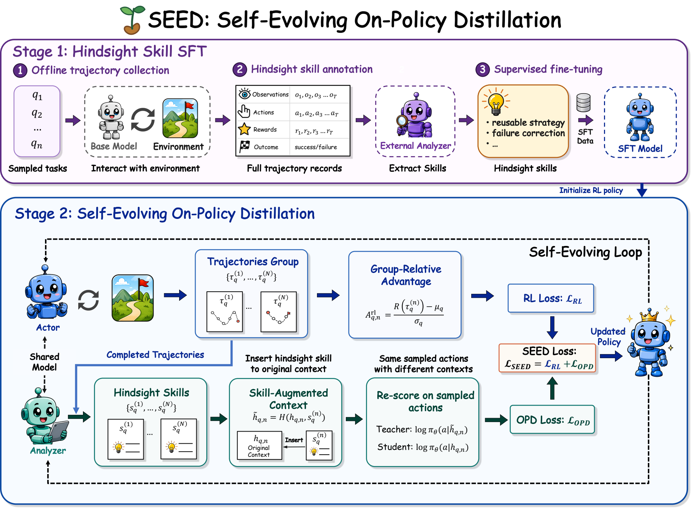
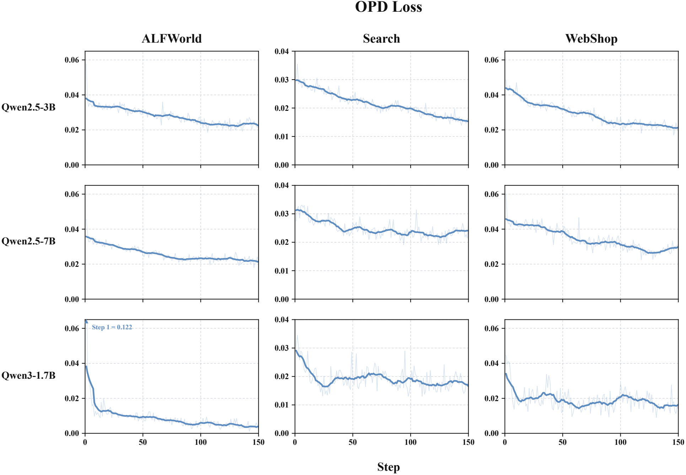
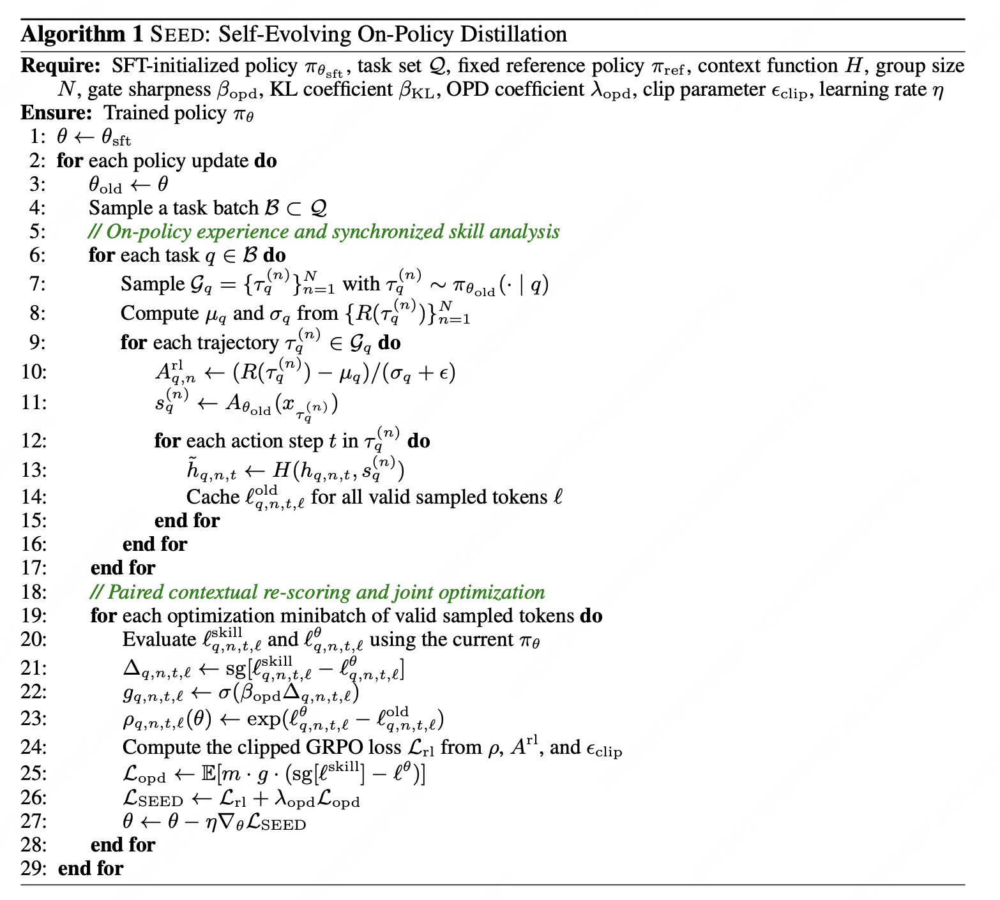
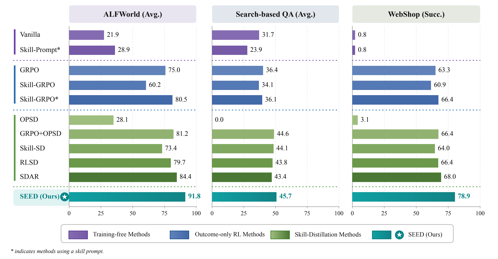
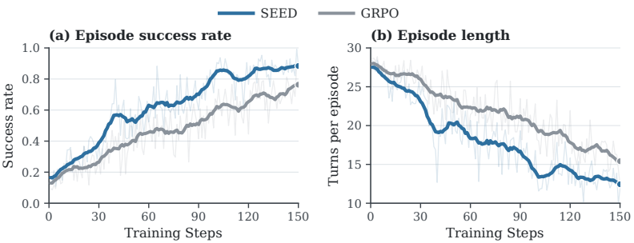
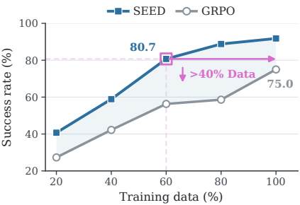
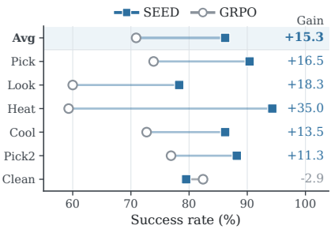
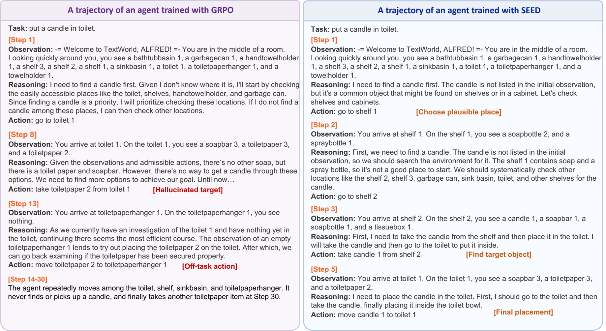

# SEED: Turning Post-Hoc Review in Long-Horizon Agent RL into Trainable Token-Level Supervision

Training an agent with RL often feels like mentoring a new hire. You know the job didn't get done, but it is hard to pin the failure down to something as specific as "missed a key piece of information at step 7", "called the tool too early at step 11", or "kept trying random things at step 15 when it should have been converging".

That is exactly what makes long-horizon agents hard to train. The environment usually returns a single outcome at the end of the episode: success or failure, a slightly higher score or a slightly lower one. Yet what the model actually has to learn is a long sequence of token-level decisions. Standard outcome-based RL says very little about which intermediate steps deserve credit and which ones need correcting.

A completed trajectory contains information that standard on-policy RL struggles to use directly: which steps form a reusable workflow, which observations actually changed later decisions, and which failures came from a local mistake rather than from the whole trajectory being worthless. SEED targets this hindsight information. It first converts completed on-policy trajectories into natural-language hindsight skills. Then, keeping the original sampled actions fixed, it re-scores the same action tokens under the plain context and under a skill-augmented context. The skill-induced probability shift becomes a dense token-level OPD signal, which is optimized back into the policy parameters together with the outcome-based RL objective.

The method figure below shows a closed loop: the current policy collects trajectories and also acts as the analyzer that extracts hindsight skills. As the policy is updated, its decision-making and its skill-analysis ability improve together. Skills used during training serve only as privileged supervision; at inference time the model needs neither external memory nor extra prompts.

## 1. Overall Method: Two-Stage Training Plus a Self-Evolving Hindsight Supervision Loop

At first glance the paper is easy to misread as "adding a skill prompt to the agent". The real difference is that in SEED, a skill is not an external hint that stays in the context at inference time. It is privileged supervision used only during training. The model first learns to extract a hindsight skill from a complete trajectory, then uses that skill to shift the probability distribution over the same sampled actions, and finally distills that shift back into the policy.

### 1. Stage 1: Hindsight-Skill SFT

The first stage is an SFT step that includes its own data construction. Start with how the offline data is produced. Let the set of training tasks be:

$$
\mathcal{Q}_{\mathrm{sft}}=\{q_j\}_{j=1}^{M}
$$

For each task $q_j$, the base policy $\pi_{\theta_{\mathrm{base}}}$ performs $K_0$ independent rollouts, producing a set of completed trajectories for that task:

$$
\mathcal{B}_j=
\left\{\tau_{j,k}\right\}_{k=1}^{K_0},
\qquad
\tau_{j,k}\sim \pi_{\theta_{\mathrm{base}}}(\cdot\mid q_j)
$$

Pooling the rollouts across all tasks gives the offline trajectory pool:

$$
\mathcal{B}=\bigcup_{j=1}^{M}\mathcal{B}_j
$$

All of these trajectories come from ordinary agent-environment interaction; no skill augmentation is used during sampling.

Next comes hindsight-skill annotation. The paper's default configuration is:

- Sample 180 training tasks
- Roll out 8 trajectories per task
- Obtain 1440 completed trajectories in total

An external trajectory analyzer (GLM5.2 in the paper) generates a hindsight skill for each completed trajectory:

$$
s_\tau=A_{\mathrm{ext}}(\tau)
$$

Here $A_{\mathrm{ext}}$ is the external trajectory analyzer and $s_\tau$ is the hindsight skill summarized from the complete trajectory $\tau$. For successful trajectories, the skill usually captures a reusable workflow, an effective order of observations, or a strategy for making progress on the task. For failed trajectories, it reads more like a corrective rule that tells the model what to avoid next time.

Only samples that pass format validation are kept. With a validity flag $v_\tau\in\{0,1\}$, the supervised dataset is:

$$
\mathcal{D}_{\mathrm{sft}}=
\left\{(x_\tau,s_\tau):\tau\in\mathcal{B}, v_\tau=1\right\}
$$

where:

- $x_\tau$ is the analysis input obtained by serializing the complete trajectory
- $s_\tau$ is the corresponding hindsight skill

The SFT objective is the standard autoregressive negative log-likelihood:

$$
\mathcal{L}_{\mathrm{sft}}(\theta)=
-\mathbb{E}_{(x_\tau,s_\tau)\sim\mathcal{D}_{\mathrm{sft}}}
\left[
\sum_{\ell=1}^{|s_\tau|}
\log \pi_\theta(s_{\tau,\ell}\mid x_\tau,s_{\tau,<\ell})
\right]
$$

Here $s_{\tau,\ell}$ is the $\ell$-th token of the hindsight skill. Training is still ordinary autoregressive next-token prediction; what changes is the supervision target. The model is no longer learning to "complete the task directly" but to "read a full trajectory and distill reusable behavioral guidance from it".

The resulting checkpoint is denoted $\theta_{\mathrm{sft}}$. The RL stage uses it to initialize both the actor policy and the synchronized analyzer.
### 2. Stage 2: Self-Evolving On-Policy Distillation

The second stage is the core of SEED. At the start of each policy update, the current policy is frozen as $\pi_{\theta_{\mathrm{old}}}$. It then plays two roles at once:

- actor: rolls out in the environment and collects on-policy trajectories
- analyzer: generates hindsight skills for the complete trajectories it just collected

For each task $q$, the old policy first samples a group of trajectories:

$$
\mathcal{G}_q=
\left\{\tau_q^{(1)},\tau_q^{(2)},\ldots,\tau_q^{(N)}\right\},
\qquad
\tau_q^{(n)}\sim\pi_{\theta_{\mathrm{old}}}(\cdot\mid q)
$$

The same old policy $\theta_{\mathrm{old}}$ then acts as the analyzer and generates a hindsight skill for each completed trajectory:

$$
 s_q^{(n)} = A_{\theta_{\mathrm{old}}}\bigl(x_{\tau_q^{(n)}}\bigr)
$$

Because the analyzer is a synchronized snapshot of the current policy, as the policy is updated:
- the trajectories it collects change
- its ability to summarize hindsight changes
- the experience distribution and the feedback supervision built on it evolve together

### 2.1 How does SEED turn a hindsight skill into token-level supervision?

#### 1. It keeps the original sampled actions and only performs paired re-scoring

For a trajectory at step $t$ with plain history $h_{q,n,t}$, a context-augmentation function first injects the skill:

$$
\tilde{h}_{q,n,t}=H(h_{q,n,t},s_q^{(n)})
$$

The original sampled action $a_{q,n,t}$ is split into a token sequence, where $ L_{q,n,t} $ is the sequence length:

$$
 a_{q,n,t}=(a_{q,n,t,1},\ldots,a_{q,n,t,L_{q,n,t}})
$$
The same sampled action tokens are then scored under two contexts.

Plain student branch:

$$
\ell^\theta_{q,n,t,\ell}=
\log \pi_\theta(a_{q,n,t,\ell}\mid h_{q,n,t}, a_{q,n,t,<\ell})
$$

Skill-conditioned teacher branch:

$$
\ell^{\mathrm{skill}}_{q,n,t,\ell}=
\log \pi_\theta(a_{q,n,t,\ell}\mid \tilde{h}_{q,n,t}, a_{q,n,t,<\ell})
$$

The teacher and the student score exactly the same sampled tokens, so there is no misalignment where the teacher follows one trajectory while the student learns from another. The only difference is that the teacher's input context contains the hindsight skill and the student's does not.

#### 2. A log-prob shift measures the effect of the hindsight skill

Define the skill-induced log-probability shift:

$$
\Delta_{q,n,t,\ell}=
\operatorname{sg}\left[
\ell^{\mathrm{skill}}_{q,n,t,\ell}-\ell^\theta_{q,n,t,\ell}
\right]
$$

Here sg denotes stop-gradient. The quantity can be read as follows:
- if the token's probability rises after the skill is injected, hindsight supports it
- if the probability falls, hindsight does not support it

SEED does not treat the hindsight skill as a hard label. What it cares about is whether the skill changes the model's preference for the current token. In other words, it projects a natural-language reflection onto a local bias over the action distribution.

#### 3. The probability difference is mapped to a gate
Define the confidence gate:

$$
 g_{q,n,t,\ell}=
 \sigma(\beta_{\mathrm{opd}}\Delta_{q,n,t,\ell})
$$

where:
- $\sigma$ is the sigmoid function
- $\beta_{\mathrm{opd}}$ controls the sharpness of the gate
- if the hindsight skill strongly supports a token, $g$ is large
- if the hindsight skill does not support it, $g$ is small

The OPD loss:

$$
\mathcal{L}_{\mathrm{opd}}(\theta)=
\mathbb{E}_{q,n,t,\ell}
\left[
 m_{q,n,t,\ell}\cdot g_{q,n,t,\ell}\cdot
 \bigl(
 \operatorname{sg}[\ell^{\mathrm{skill}}_{q,n,t,\ell}] - \ell^\theta_{q,n,t,\ell}
 \bigr)
\right]
$$

Here $m_{q,n,t,\ell}$ is the valid-token mask, so loss and gradients are computed only on action tokens that were actually generated and carry meaning.

The gradient is:

$$
\nabla_\theta \mathcal{L}_{\mathrm{opd}}=
-\mathbb{E}_{q,n,t,\ell}
\left[
 m_{q,n,t,\ell}\cdot g_{q,n,t,\ell}\cdot
 \nabla_\theta \ell^\theta_{q,n,t,\ell}
\right]
$$

Because both the gate and the teacher log-prob are stop-gradient, the loss is essentially a gate-weighted NLL. More precisely, the policy concentrates its probability increases on on-policy tokens that the hindsight skill supports and that therefore receive larger gates.

The figure below shows that in most settings the OPD loss decreases steadily from its initial value and stabilizes later in training. A lower OPD loss means the policy, under the plain context, is increasingly willing to assign higher probability to actions backed by hindsight supervision. Together with the rising success rate, these curves indicate that SEED's self-evolving loop is stable and that the behavioral guidance from hindsight skills is being steadily internalized by the policy.

### 2.2 SEED adds a finer-grained supervision path on top of GRPO

SEED does not discard outcome-based RL. It adds an auxiliary OPD term on top of the GRPO loss.

For each task's trajectory group $\mathcal{G}_q$, first compute the group mean and standard deviation:

$$
\mu_q=
\frac{1}{N}\sum_{n=1}^{N}R(\tau_q^{(n)}),
\qquad
\sigma_q=
\sqrt{\frac{1}{N}\sum_{n=1}^{N}\left(R(\tau_q^{(n)})-\mu_q\right)^2}
$$

This yields the trajectory-level group-relative advantage:

$$
A^{\mathrm{rl}}_{q,n}=
\frac{R(\tau_q^{(n)})-\mu_q}{\sigma_q+\epsilon}
$$

which is then broadcast to the valid tokens:

$$
A^{\mathrm{rl}}_{q,n,t,\ell}=A^{\mathrm{rl}}_{q,n}m_{q,n,t,\ell}
$$

The policy ratio is:

$$
\rho_{q,n,t,\ell}(\theta)=
\exp\bigl(\ell^\theta_{q,n,t,\ell}-\ell^{\mathrm{old}}_{q,n,t,\ell}\bigr)
$$

The corresponding RL term is the clipped group-relative policy objective:

$$
\mathcal{L}_{\mathrm{rl}}(\theta)=
-\mathbb{E}_{q,n,t,\ell}
\left[
\min\Bigl(
\rho_{q,n,t,\ell}(\theta)A^{\mathrm{rl}}_{q,n,t,\ell},
\operatorname{clip}(\rho_{q,n,t,\ell}(\theta),1-\epsilon_{\mathrm{clip}},1+\epsilon_{\mathrm{clip}})A^{\mathrm{rl}}_{q,n,t,\ell}
\Bigr)
\right]
+\beta_{\mathrm{KL}}D_{\mathrm{KL}}
$$

The final joint objective is:

$$
\mathcal{L}_{\mathrm{SEED}}(\theta)=
\mathcal{L}_{\mathrm{rl}}(\theta)+
\lambda_{\mathrm{opd}}\mathcal{L}_{\mathrm{opd}}(\theta)
$$

SEED can be understood as:

- GRPO handles trajectory-level outcome optimization
- OPD handles token-level hindsight supervision

The former answers "which trajectory is better overall"; the latter answers "which local decisions within a trajectory deserve more reinforcement".

## 3. Algorithm Pseudocode

The figure below is the algorithm pseudocode from the original paper. It splits the SEED training loop into two parts:
1. Collect trajectories with the old policy and generate hindsight skills alongside them
2. With the current trainable policy, re-score the same sampled tokens under the plain context and the skill context, then jointly optimize the RL loss and the OPD loss

From a training-pipeline perspective, one SEED update breaks down into:

- rollout
- analyze trajectory
- rebuild teacher context
- re-score sampled tokens
- compute GRPO objective
- compute OPD objective
- joint update

## 4. Experimental Results

### 1. Main results: all three long-horizon task families benefit, across model sizes

The paper reports consistent gains on ALFWorld, Search-based QA, and WebShop. The first two cover long-horizon interaction in a text environment and search-augmented QA; the third covers multi-step web navigation and purchase decisions. The task formats differ substantially, yet SEED improves all of them in the same direction.

Looking at the aggregate metrics alone makes SEED's gain over GRPO even clearer:

| Backbone | ALFWorld Avg | Search Avg | WebShop Score | WebShop Success |
| --- | --- | --- | --- | --- |
| Qwen2.5-3B | 75.0 → 91.8 (+16.8) | 36.4 → 45.7 (+9.3) | 79.8 → 88.5 (+8.7) | 63.3 → 78.9 (+15.6) |
| Qwen2.5-7B | 81.2 → 96.1 (+14.9) | 42.0 → 48.6 (+6.6) | 80.9 → 89.7 (+8.8) | 72.6 → 78.1 (+5.5) |
| Qwen3-1.7B | 46.1 → 92.0 (+45.9) | 40.8 → 42.2 (+1.4) | 67.3 → 87.1 (+19.8) | 38.3 → 77.3 (+39.0) |

Two observations stand out. First, the gains span three different kinds of agent tasks, so this is not a quirk of a single benchmark. Second, smaller models benefit the most: Qwen3-1.7B improves dramatically on both ALFWorld and WebShop. This suggests hindsight supervision is especially helpful for small models, whose credit assignment is coarse and whose exploration is noisier. Put differently, SEED is not just "a bit more training"; it makes every trajectory yield finer-grained optimization signal.

The baselines tell the same story. Skill-Prompt, which only attaches skills at test time, and Skill-GRPO, which brings skills into RL but still relies mainly on outcome optimization, do not consistently match SEED. Static distillation methods such as OPSD, Skill-SD, RLSD, and SDAR also help, but none of them reliably beats SEED across all three task families. SEED's advantage is not merely that it "sees the skill"; it actually distills the behavioral effect of the hindsight skill into the policy parameters.

### 2. Training dynamics: it pulls ahead earlier, with shorter interaction paths

The main results show that SEED ends up stronger; the training dynamics explain why. In the paper's ALFWorld curves, SEED's success rate separates from GRPO early on, and its average episode length drops faster.

Two signals in this figure should be read together. The success rate rises earlier, which means SEED enters the productive learning phase sooner. Episode length falls at the same time, which means what SEED removes is not useful reasoning but wasted exploration and repeated trial and error. Both point to the token-level hindsight signal from OPD correcting local behavioral errors in the trajectory earlier. This matters a lot for long-horizon agents. A model often fails not because it has no idea how to do the task, but because it takes a few unnecessary detours, searches in the wrong place, or does things in the wrong order. The steeper training curves show that hindsight supervision is particularly good at fixing this kind of mid-trajectory drift.

### 3. Sample efficiency: each completed trajectory yields more supervision

A method that only improves by training longer usually looks poor on sample efficiency. SEED provides fairly strong evidence to the contrary: under the same data budget, it reaches higher performance earlier than GRPO.

On ALFWorld, GRPO averages 75.0 with 100% of the data, while SEED reaches 80.7 with only 60%. With 40% of the data SEED reaches 58.9, already close to GRPO's 58.6 at 80%. WebShop shows a similar trend: GRPO's success is 63.3 at 100% of the data, while SEED reaches 75.0 at 80% and climbs to 78.9 at 100%.

These results show that SEED does not change the environment reward of a trajectory, but it does change how much of that trajectory the training system can use. Outcome-only RL gets a single coarse signal from the end of the trajectory. SEED adds a round of hindsight analysis after the trajectory finishes and folds reusable workflows, decisive observations, and failure-avoidance rules back into token-level distillation. As a result, the same completed trajectory provides considerably more supervision.

### 4. Generalization and case study: it learns more robust policy patterns

A method that merely memorizes the training set usually drops off sharply in unseen environments. SEED's results on the ALFWorld unseen split are more encouraging.

On Qwen2.5-3B, GRPO's average unseen success rate is 70.9, and SEED raises it to 86.2, a gain of 15.3 points. The largest gains are in Heat (+35.0), Look (+18.3), and Pick (+16.5). This suggests that SEED learns more than surface patterns from the training trajectories. What it acquires is closer to a transferable behavioral bias: given a task, what to look at first, what to rule out first, and how to order the search all become more stable.

The paper's ALFWorld case study supports this. The GRPO policy goes to the target container first, then looks for the target object, picks up irrelevant items along the way, and falls into an unproductive loop. SEED instead searches the more plausible storage locations first, finds the target object, and then completes the placement.

The difference resembles splitting "can it do the task" into "can it do the task in a more human-like order". The former decides whether the task ultimately succeeds; the latter decides whether the agent takes detours, gets stuck, or wastes its limited interaction steps going in the wrong direction. Both the generalization results and the case study show that SEED optimizes not just for a higher reward, but for a more stable pattern of local decisions.

### 5. Ablations: on-policy skills, self-evolution, and the SFT foundation are all necessary

The paper runs three ablations on ALFWorld. Full SEED averages 91.8. Removing hindsight-skill SFT drops it to 86.0; removing self-evolving OPD drops it to 87.0; replacing on-policy skills with static offline skills drops it to 84.4.

Taken together, the message is clear.

- Hindsight-skill SFT gives the actor and the analyzer a shared foundation for trajectory analysis. Without it, later RL can still learn, but the quality of supervision drops noticeably.
- Self-evolving OPD keeps hindsight supervision refreshed alongside the current policy. One-off skill learning from the first stage alone is not strong enough.
- Replacing on-policy skills with static skills causes the largest drop, which shows that hindsight supervision is tightly coupled to the states, actions, and failure modes the current policy actually visits.

## 5. Paper Summary

- Compared with methods like Skill Prompt, SEED does not attach skills at inference time. During training, it builds a skill-augmented context only to observe how the hindsight skill shifts the probability distribution over the same sampled actions, and then distills that shift back into the plain policy. That is why what it ultimately learns is a behavioral bias internalized in the parameters, rather than a set of external hints that must still be carried around at deployment.

- Compared with standard GRPO, SEED does not add a new environment reward. It adds a finer-grained hindsight supervision path. GRPO distinguishes "which trajectory is better" at the trajectory level, while SEED further answers "which local tokens within a trajectory deserve more reinforcement". This is the main reason its training curves pull ahead earlier on long-horizon tasks while the average interaction length shrinks.

- Compared with static distillation methods, the key difference is the synchronized analyzer. The teacher is not a fixed external model but a synchronized copy of the current policy. The trajectories are sampled by the current policy and the skills are produced by the current policy, so the auxiliary supervision always tracks the current visitation distribution, and teacher staleness is greatly reduced.

- The broader lesson of the paper is that a post-hoc review does not have to remain analysis material; it can become a training signal directly. Many projects keep trajectory replays, failure cases, and run logs, but usually only use them for debugging or case studies. SEED goes further and turns this hindsight information into a teacher-side probability shift, then folds it back into token-level distillation. Here, natural-language skills are not a memory component but privileged supervision used during training.

- This approach is not free. Stage 1 hindsight-skill SFT depends on a usable trajectory analyzer, and stage 2 adds full-trajectory analysis, skill-context reconstruction, and paired re-scoring. The training pipeline is clearly heavier than standard GRPO; in essence, it trades more compute for denser supervision.

- Its ceiling is still bounded by the quality of the hindsight skills. SEED guarantees a more sensible supervision structure that stays consistent with on-policy sampling, but it cannot guarantee that every review is insightful. If a skill is shallow, or if the attribution itself is off, the gain from OPD shrinks accordingly.

## Appendix: Training Hyperparameters

### 1. RL

| Parameter | Value |
| --- | --- |
| Training hardware | 8 × Nvidia A800 80G GPUs |
| Training steps | 150 |
| Training batch size | 16 for ALFWorld / WebShop; 128 for Search-based QA |
| Validation batch size | 128 for ALFWorld / WebShop; 512 for Search-based QA |
| Rollout group size $N$ | 8 |
| Learning rate | $1\times10^{-6}$ |
| Learning-rate warmup | 0.1 |
| PPO mini-batch | 256 for ALFWorld; 64 for WebShop; 512 for Search-based QA |
| Actor micro-batch per GPU | 32 for ALFWorld; 8 for WebShop; 16 for Search-based QA |
| Rollout log-prob micro-batch per GPU | 32 for ALFWorld; 16 for WebShop; 32 for Search-based QA |
| Reference log-prob micro-batch per GPU | 32 for ALFWorld; 16 for WebShop; 32 for Search-based QA |
| PPO clip coefficient $\epsilon_{\mathrm{clip}}$ | 0.2 |
| OPD gate coefficient $\beta_{\mathrm{opd}}$ | 5.0 |
| OPD loss coefficient $\lambda_{\mathrm{opd}}$ | 0.01 |
| KL coefficient $\beta_{\mathrm{KL}}$ | 0.01 |
| KL loss coefficient | 0.01 for ALFWorld / WebShop; 0.001 for Search-based QA |
| KL type | low_var_kl for ALFWorld / Search-based QA; not reported separately for WebShop |
| Entropy coefficient | Not set explicitly for ALFWorld / WebShop; 0 for Search-based QA |
| Invalid-action penalty coefficient | 0.1 for ALFWorld / WebShop; 0.01 for Search-based QA |
| Max input length | 2048 for ALFWorld; 4096 for WebShop / Search-based QA |
| Max output length | 512 |
| Max interaction steps | 30 for ALFWorld; 15 for WebShop; 4 for Search-based QA |
| History length | 5 for ALFWorld; 2 for WebShop; 4 for Search-based QA |
| Analysis context length | 16384 |
| Analysis max completion tokens | 4096 |
| Analysis max model length | 20480 |
| Max skills per trajectory | 5 for ALFWorld / WebShop; 2 for Search-based QA |
| Training backend | verl.trainer.main_ppo + vllm |

### 2. SFT

| Parameter | Value |
| --- | --- |
| Distributed framework | verl.trainer.fsdp_sft_trainer |
| Training hardware | 8 × Nvidia A800 80G GPUs |
| Epochs | 3 |
| Learning rate | 5e-6 |
| Training batch size | 8 |
| Micro-batch size per GPU | 1 |
| Gradient checkpointing | Enabled |
| Sequence parallel size | ulysses_sequence_parallel_size=1 |
| Max sequence length | 8192 for ALFWorld; 12288 for WebShop / Search |
| Truncation | left for ALFWorld; truncation=error for WebShop / Search |
